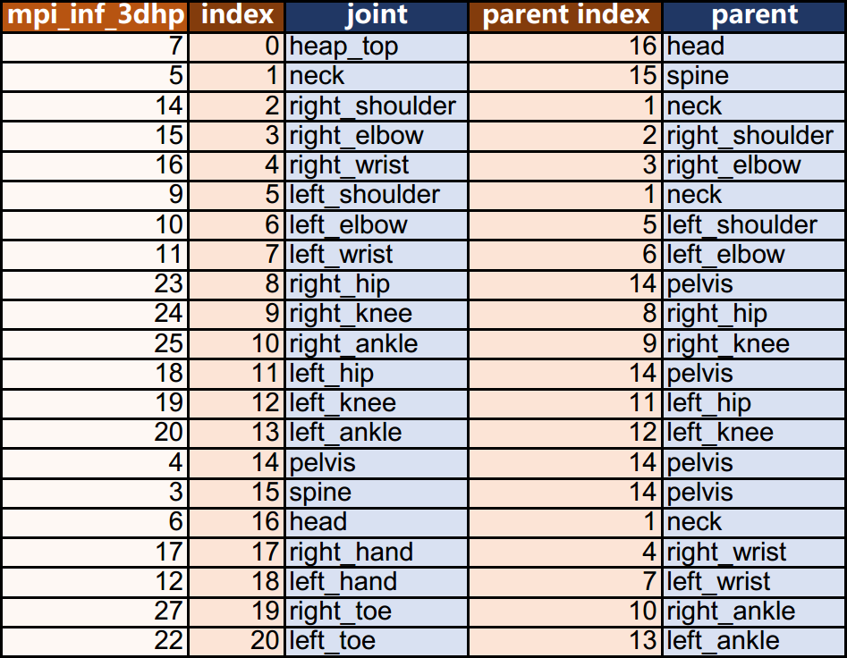
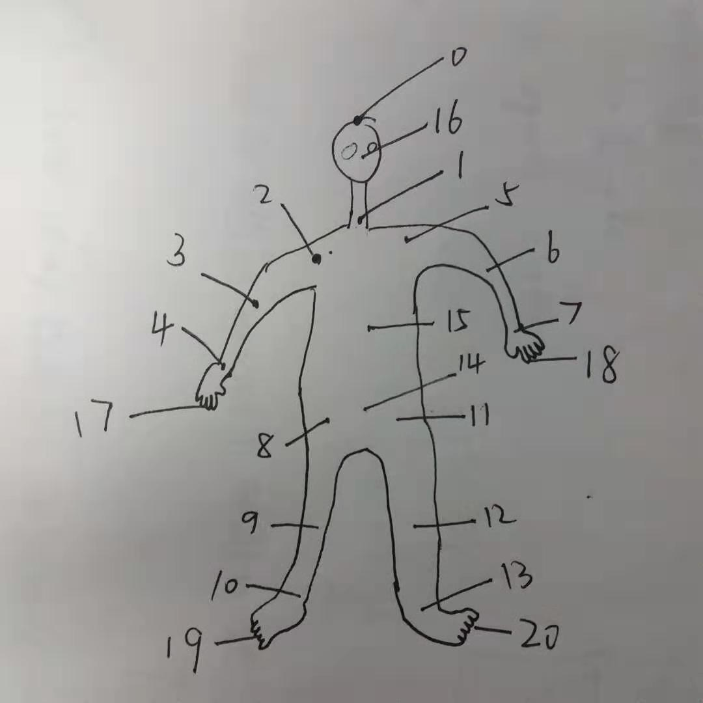

# VNect

A tensorflow implementation of [VNect: Real-time 3D Human Pose Estimation with a Single RGB Camera](http://gvv.mpi-inf.mpg.de/projects/VNect/).

For the **caffe model** required in the repository: please contact [the author of the paper](http://gvv.mpi-inf.mpg.de/projects/VNect/).

    

    

## Environments

- Windows 10 Pro
- Python 3.5.6 (64 bit)
- opencv-python 3.4.4.19
- tensorflow-gpu 1.12.0
- [pycaffe](https://github.com/BVLC/caffe/tree/windows)

## Usage

1. Drop the caffe model into `models/caffe_model`.
2. Run `caffe2pkl.py` to transfer the caffe model (and weights) to pickle format.
3. Run `vnect_model.py` to generate tensorflow model (graph and weights).
4. Run `benchmark.py` to test video: 
   1. click the left mouse button to confirm a simple static bounding box generated by HOG method;
   2. trigger any keyboard input to exit at any time.
5. (Not compulsory) Run `test_pic.py` to test image: the outputs are 4×21 heatmaps and 2D results.

## Notes

1. The input image is in **BGR** color format and is regulated into a range of [-0.4, 0.6).
2. The joint-parent map (can also see in `joint_index.xlsx`):

    

3. The joint positions (index numbers as above):

    

4. Every input image is assumed to contain 21 joints to be found, which means it is easy to fit wrong results when a joint is actually not in the input.
5. The results of the model in this implementation are **not as good** as the results shown in the video provided by the paper author, especially when predicting unusual postures (e.g. sitting on the ground).

## TODO

1. Optimize the structure of the codes.
2. Implement a better bounding box strategy.
3. Figure out the reason why **matplotlib 3.0.2** is likely to be stuck.

## Reference Repositories

- original MATLAB implementation provided by the model author
- [timctho/VNect-tensorflow](https://github.com/timctho/VNect-tensorflow)
- [EJShim/vnect_estimator](https://github.com/EJShim/vnect_estimator)